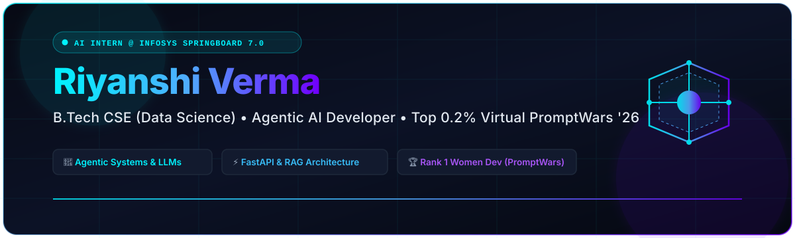

<!-- Premium GitHub Profile README for Riyanshi Verma -->

  

 

  <h3>
    <a href="https://RiyanshiVerma-11.github.io">Portfolio Webpage</a> •
    <a href="https://www.linkedin.com/in/riyanshi-verma-ba363a2b2">LinkedIn</a> •
    <a href="https://github.com/RiyanshiVerma-11">GitHub</a> •
    <a href="mailto:riyanshiverma46@gmail.com">Email</a>
  </h3>

  

 

---

### 🧬 About Me

  <picture>
    <source media="(prefers-color-scheme: dark)" srcset="https://readme-typing-svg.herokuapp.com?font=Fira+Code&weight=500&size=20&duration=3000&pause=1000&color=00F2FE&center=true&vCenter=true&width=600&lines=AI+Intern+%40+Infosys+Springboard+7.0;Rank+4%2F4.2k%2B+in+HackDevengers+1.0;Top+0.2%25+Nationally+in+Virtual+PromptWars;Building+Agentic+Systems+%26+LLMs" />
    <source media="(prefers-color-scheme: light)" srcset="https://readme-typing-svg.herokuapp.com?font=Fira+Code&weight=500&size=20&duration=3000&pause=1000&color=002147&center=true&vCenter=true&width=600&lines=AI+Intern+%40+Infosys+Springboard+7.0;Rank+4%2F4.2k%2B+in+HackDevengers+1.0;Top+0.2%25+Nationally+in+Virtual+PromptWars;Building+Agentic+Systems+%26+LLMs" />
    
  </picture>

 

B.Tech Computer Science (Data Science) student passionate about building **agentic systems** using **Python, FastAPI, and LLMs**. Built scalable healthcare, civic, and fintech AI applications through academic, internship, and hackathon projects. **Ranked 4th / 4.2k+ in HackDevengers 1.0 (HospiSynAI)** & **top 0.2% nationally (Rank 1 Women Dev & Rank 30 / 26,090+) in Virtual PromptWars 2026**.

*   🎓 **Education:** B.Tech in CSE (Data Science) | **CGPA: 8.47 / 10.0** — Meerut Institute of Engineering and Technology (AKTU)
*   💼 **Current Experience:** AI Intern at **Infosys Springboard 7.0** (Developing [CommAI](https://github.com/RiyanshiVerma-11/CommAI) - Enterprise Multilingual AI Mass Communication Platform)
*   🧠 **Core Expertise:** Agentic Workflow Orchestration, RAG Architectures, LLM Fine-Tuning & Inconsistency Auditing, FastAPI Microservices, PWA Edge AI
*   📚 **Coursework:** DBMS, Object-Oriented Programming, Computer Networks, Machine Learning

---

### 💼 Professional Experience

> #### **AI Intern — Infosys Springboard 7.0** *(July 2026 – Present)*
> *   Selected for a highly competitive virtual internship program under the 7.0 cohort, focusing on enterprise-level AI applications to design and develop **[CommAI](https://github.com/RiyanshiVerma-11/CommAI)** (an installable PWA-based, AI-powered multilingual mass communication platform).
> *   Engineered a Generative AI content engine (**Groq Llama 3.3/3.1**) with translation failover pipeline (**70B → 8B → Google Translate API fallback**) to localize campaigns into **23 Indian languages** with tone personalization and RAG-powered auto-drafted citizen responses.
> *   Architected an offline NLP compliance auditor and **"Maker-Checker" governance system** (auto-triggered at 100+ recipients/Emergency status) for safe omnichannel broadcasts (Email, Telegram, SMS, Push, Call), plus a 23-language voice bulletin engine, hands-free "Hey Jarvis" cockpit, and SOS incident triage portal.

---

### 🛠️ Technical Skills

<table width="100%">
  <tr>
    <td width="50%" valign="top">
      <h4>🐍 Languages &amp; Core</h4>
      
      
      
    </td>
    <td width="50%" valign="top">
      <h4>⚛️ Frameworks &amp; Libraries</h4>
      
      
      
      
      
    </td>
  </tr>
  <tr>
    <td width="50%" valign="top">
      <h4>🧠 AI &amp; Machine Learning</h4>
      
      
      
      
      
      
      
    </td>
    <td width="50%" valign="top">
      <h4>⚙️ Tools, Cloud &amp; IDEs</h4>
      
      
      
      
      
      
      
      
    </td>
  </tr>
</table>

---

### 🚀 Key Projects

> **[HospiSynAI](https://github.com/RiyanshiVerma-11/HospiSynAI)** 🏆 **Rank 4 / 4.2k+ (HackDevengers 1.0)** | *React, FastAPI, Docker, Neon PostgreSQL, Vercel, Render* | **[Live Demo](https://hospi-syn-ai.vercel.app/)**
> *   **Ranked 4th among 4,200+ participants** in **HackDevengers 1.0 (2026)**, an 8-hour global hackathon by Devengers, for building HospiSynAI, an AI-powered hospital management & billing platform.
> *   Built an AI-assisted hospital consultation & billing platform where doctors enter patient symptoms/clinical notes to instantly generate structured prescriptions, dosing plans, and patient handouts in **11 Indian languages** using **FastAPI** and Groq-powered **Llama 3.3 70B** with under **1.5s latency**.
> *   Developed a hybrid **AI Billing Auditor** that scans invoice line items before checkout, combining rule-based checks with LLM reasoning to flag **6 critical clinical and billing inconsistencies** (such as ICU+OPD conflicts, GST non-compliance, and pediatric dosing errors), simulating a **76% reduction in manual verification time** (from ~6 mins to 1.5 mins per invoice).
> *   Containerized and deployed a decoupled React, FastAPI, and Neon PostgreSQL stack using Docker, Vercel, and Render, implementing SQLAlchemy connection pooling, role-based access control (RBAC), audit logging, and ReportLab server-side PDF receipt generation.

> **[FinSight](https://github.com/RiyanshiVerma-11/FinSight)** | *React, FastAPI, Groq LLMs, Python, Render* | **[Live Demo](https://finsight-frontend-r0a8.onrender.com/)**
> *   Built an AI-driven analytics platform that calculates **Revenue at Risk (RAR)** by analyzing UPI and banking transaction patterns using **RFM behavioral modeling**.
> *   Designed interactive 'What-if' simulation dashboards using React and Groq LLMs that enabled product managers to quantify intervention ROI, generating testable business hypotheses from UPI/banking data and directly supporting data-driven decision-making.

> **[VoteWise AI](https://github.com/RiyanshiVerma-11/VoteWise-AI)** | *FastAPI, Gemini 2.0 Flash, Google Maps API, Pytest, Render* | **[Live Demo](https://votewise-ai-bode.onrender.com/)**
> *   Built a responsive FastAPI election app using **Gemini 2.0 Flash**, Google Embeddings, and SQLite3 in-memory caching to deliver low-latency, multilingual (**6 regional languages**) civic guidance.
> *   Designed an offline-capable PWA integrated with the **Google Maps API** to visualize polling booths and voter density heatmaps with WCAG 2.1 AA accessibility.
> *   Integrated Google One-Tap OAuth and configured a GitHub Actions CI/CD pipeline with Pytest to automate testing and secure user onboarding.

> **[AssessIQ](https://github.com/RiyanshiVerma-11/AssessIQ)** | *FastAPI, SQLite, WebSockets, MediaPipe, TensorFlow.js, Docker, Render* | **[Live Demo](https://assessiq-z5cg.onrender.com/)**
> *   Developed a smart assessment platform incorporating browser-side edge AI proctoring via **MediaPipe Face Mesh** and **Coco-SSD object detection** to flag suspicious behaviors (like mobile phone usage) directly on the client's GPU, minimizing backend streaming load.
> *   Designed real-time alert dispatch pipelines over **WebSockets** to sync browser proctoring warnings to a FastAPI backend instantly.
> *   Integrated **Groq Llama 3** models to enable fully dynamic, topic-specific exam generation and instant qualitative auto-grading for subjective questions.

---

### 🏆 Achievements & Honors

*   **🏆 Rank 4 / 4,200+ Participants — HackDevengers 1.0 (2026)**
    *   Organized by **Devengers** (8-Hour Global Hackathon).
    *   Ranked **4th among 4.2k+ participants** globally for building **HospiSynAI**, an AI-powered hospital management and billing platform featuring Groq Llama 3.3 70B clinical note processing, 11-language prescription generation, and hybrid AI billing auditing.
*   **🏆 Rank 1 (Women Developer) & Overall Rank 30 / 26,090+ (Virtual PromptWars 2026)**
    *   Organized by **Google for Developers** & **Hack2Skills**.
    *   Ranked in the **top 0.2% nationally** out of 26,090+ participants. Developed *VoteWise AI* achieving a **96.98% AI-verified score** in code quality, security, efficiency, Google services, and accessibility.
*   **🏅 Gateway Classes Academic Excellence Cup**
    *   Awarded for achieving a **9.02 YGPA** and outstanding academic performance during the first year of B.Tech.

---

### 📜 Certifications

*   💎 **Google Skills Profile – Diamond League** *(21,635 points)* — [View Profile](https://www.cloudskillsboost.google/public_profiles/6d9c6c4c-43f1-49fa-986c-843a9f0e1fec)
*   ⚙️ **Infosys Springboard** – Pragati: Path to Future (Cohort 6)
*   🧠 **Infosys Springboard** – Prompt Engineering

---

### 📊 GitHub Activity & Stats

  <table border="0" cellspacing="0" cellpadding="0">
    <tr>
      <td>
        
      </td>
      <td>
        
      </td>
    </tr>
  </table>
   
  

 

  
💡 <i>"The best way to predict the future is to encode it."</i>

